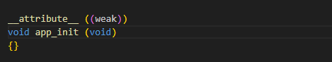
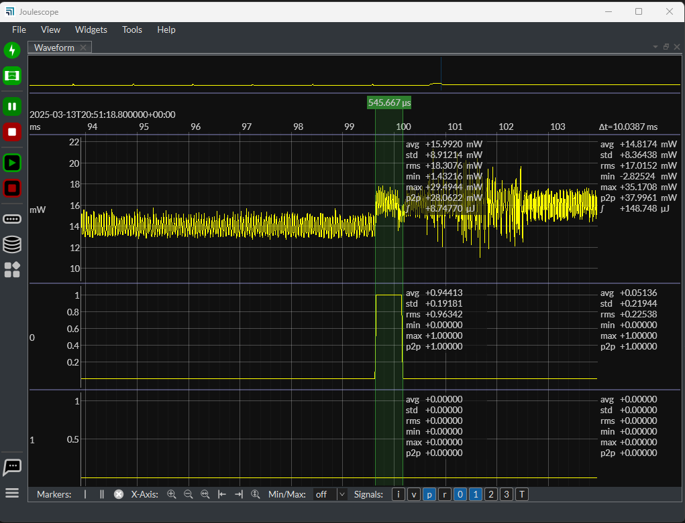

Application Note

**E1C Power cycle demo**

**Version 1.0**

**  
**

**STOP Mode Power Cycle Demo**

This demo shows how to optimize the configuration of an Alif Ensemble or Balletto MCU to quickly cycle between GO and STOP power modes. For highly constrained battery-operated devices, minimizing the time spent active is a key requirement to achieving multiple days or weeks of battery life. In pursuit of minimizing the time spent active, Alif has optimized the boot and shut-down process to minimize the time spent in the transition between states. Time spent transitioning between states adds to the overall active time of the application, it results in wasted energy since this is time that the MCU is not spending in STOP Mode. The scope of this project is to demonstrate a configuration for the Alif MCU which can quickly enter and exit from MCU STOP Mode in 1 millisecond or less.

The sample project demonstrates the following Alif MCU features

- MCU STOP Mode: a low-power mode consuming a handful of microwatts

- SRAM Retention: keep code and data retained in fast SRAM while the MCU is stopped

- Terminal Interface: type in the use case details (time spent on/off) when prompted

- NPU Power Test: run Keyword Spotting (MicroNet Medium) on a sample of audio

Following this guide you’ll be able to build and run this project to measure your own boot times.

This project is equipped with a terminal interface that will be launched after programming this demo to the Alif MCU. This terminal interface will prompt you to enter a few use case details. The first prompt asks for the "application duty cycle". This is used to define how often the MCU will wake from stop mode. Entering 100, for example, the MCU will enter stop mode and wake precisely every 100 milliseconds. The second prompt asks for the "time spent running while(1)". This defines how long the MCU will stay awake and would, for example, represent the time spent doing sensor data gathering before returning to stop mode. This should be a fraction of the previous entry. The final prompt asks for the "number of inferences" to run on the NPU. Typically enter 1 here. Every ten power cycles, the application will exercise the NPU, and the length of time spent exercising the NPU depends on the number entered in the final prompt.

Using a power analyzer, it is possible to monitor the MCU power draw in real-time as the MCU transitions between the GO and STOP power modes. It should also be possible to calculate the average power draw (for battery life estimates) and experiment with different combinations for the use case inputs.

**Before Starting:**

If you have not yet set up your Alif development environment using VS Code, please first visit the “[Getting Started with VSCode](https://github.com/alifsemi/alif_vscode-template/blob/main/doc/getting_started.md)” Guide. Ensure that you are able to build and run the blinky demo on your Alif DevKit before following this guide.

**Hardware Quick Start:**

1.  Balletto DevKit (Rev. B) and micro-USB cable

2.  Joulescope Power Analyzer

Remove power to the Alif DevKit before beginning to attach the Joulescope:

1.  Remove shunt on JP1, this disconnects the “USB_V” 3V3 supply.

2.  Remove shunt on JP3, this disconnects the “SOC_PWR” supply.

3.  Attach Joulescope Current+ terminal to pin 3 of JP3 and Current- terminal to pin 2 of JP3 

4.  Attach Joulescope Voltage- terminal to pin 1 of J9, J10, J11, or J14 (GND) 

5.  Attach Joulescope Voltage+ terminal to pin 6 of J9, J10, or J11 (1.8V supply) 

Now plug in the micro-USB cable to the “PRG USB” connector on the DevKit. You should see two serial ports appear on your machine. The first serial port is for SE UART and is meant to be used with the Alif Security Toolkit.

The second port is configured for LP UART and is used by this demo.

Open a terminal connecting to the second port and configure the speed for 115200.

**Software Quick Start:**

To start, clone the power cycle repo and then open the cloned directory in Visual Studio Code.

\`\`\`

git clone https://github.com/alifsemi/alif_powercycle_vscode-template.git

\`\`\`

In VSCode, press F1 and select “Tasks: Run Task”. From the list of tasks, select “First time pack installation”. VS Code will exercise cpackget to obtain the necessary Alif and Arm pack files. Once completed, you should see “Pack installation has been completed” message in the console.

If the pack installation is successful press F1 again and select "Tasks: Run Task".

Press the build option from the CMSIS solution to build the environment. Ensure to choose the E1C as target in the build context.

Check that the build is successful. If the application was built press F1 once more and select "Tasks: Run Task". From the list of tasks select "Program with Security Toolkit".

**After Programming**

After programming this demo to the Alif MCU, you will be prompted to enter the use case details. The first prompt asks for the "application duty cycle". This is used for the wake period; it defines how often the MCU will wake from stop mode. Entering 100, for example, the MCU will enter stop mode and wake every 100 milliseconds. The second prompt asks for the "time spent running while(1)". This defines how long the MCU will stay awake before returning to stop mode. This should be a fraction of the previous entry. The final prompt asks for the "number of inferences" to run on the NPU. Typically enter 1 here. Every ten power cycles, the application will exercise the NPU, and the length of time spent exercising the NPU depends on the number entered in the final prompt. Using a power analyzer, it should be possible to monitor the current as the MCU transitions between the two power states and calculate the average current draw.

The joulescope shows the power cycle when the application goes into the stop mode. The application duty cycle refers to time before the system boots back up to perform the NPU inferences and then moves back into the stop mode. A power spike is seen during NPU inferences.

**Measure time between reset handler and main: (Optional)**

The joulescope can additionally be used to measure the time taken by the program to jump between the reset handler and to the main. This is an optional measurement and the code for this has been added to the project. The output and the input pins of the joulescope can be used for poking the available GPIO pins and these can be measured in the software.

Setup:

1)Connect all the GND pins to the GND pins on the board. The GND pin is the pin 1 on J11, J10, J14.

2)Connect OUT0 to Pin 7 on J11 which is the POR

3)Connect the Vref to Pin 6 on J11 which is the 1.8V Vref.

4)Connect IN0 pin2 of J10 which is the P5_0 (GPIO)

5)Connect IN1 pin 7 of J10 which is the P5_4 (GPIO)

In the startup code(system_M55.c), declare a weak function. Please see below

This function is defined in the app folder of the application in a separate C file (Refer to the app_init.c) Use this function to set any GPIO pin to 1 and set the direction of the GPIO as output. (in this example, P5_0 is set to 1).

This GPIO can be reset to 0 in the main. When the system boots up, we see the GPIO is set and reset to 0 when the main is called. The time between the transition shows the time taken by the program to jump from the reset handler to the main.

