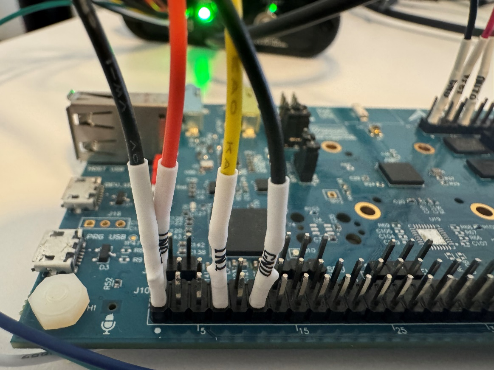

Application Note

**E1C Power cycle demo**

**Version 1.0**

**  
**

**STOP Mode Power Cycle Demo**

This demo shows how to optimize the configuration of an Alif Ensemble or Balletto MCU to quickly cycle between GO and STOP power modes. For highly constrained battery-operated devices, minimizing the time spent active is a key requirement to achieving multiple days or weeks of battery life. In pursuit of minimizing the time spent active, Alif has optimized the boot and shut-down process to minimize the time spent in the transition between states. Time spent transitioning between states adds to the overall active time of the application, it results in wasted energy since this is time that the MCU is not spending in STOP Mode. The scope of this project is to demonstrate a configuration for the Alif MCU which can quickly enter and exit from MCU STOP Mode in 1 millisecond or less.

The sample project demonstrates the following Alif MCU features

- MCU STOP Mode: a low-power mode consuming a handful of microwatts

- SRAM Retention: keep code and data retained in fast SRAM while the MCU is stopped

- Terminal Interface: type in the use case details (time spent on/off) when prompted

- NPU Power Test: run Keyword Spotting (MicroNet Medium) on a sample of audio

Following this guide you’ll be able to build and run this project to measure your own boot times.

This project is equipped with a terminal interface that will be launched after programming this demo to the Alif MCU. This terminal interface will prompt you to enter a few use case details. The first prompt asks for the "application duty cycle". This is used to define how often the MCU will wake from stop mode. Entering 100, for example, the MCU will enter stop mode and wake precisely every 100 milliseconds. The second prompt asks for the "time spent running while(1)". This defines how long the MCU will stay awake and would, for example, represent the time spent doing sensor data gathering before returning to stop mode. This should be a fraction of the previous entry. The final prompt asks for the "number of inferences" to run on the NPU. Typically enter 1 here. Every ten power cycles, the application will exercise the NPU, and the length of time spent exercising the NPU depends on the number entered in the final prompt.

Using a power analyzer, it is possible to monitor the MCU power draw in real-time as the MCU transitions between the GO and STOP power modes. It should also be possible to calculate the average power draw (for battery life estimates) and experiment with different combinations for the use case inputs.

**Before Starting:**

If you have not yet set up your Alif development environment using VS Code, please first visit the “[Getting Started with VSCode](https://github.com/alifsemi/alif_vscode-template/blob/main/doc/getting_started.md)” Guide. Ensure that you are able to build and run the blinky demo on your Alif DevKit before following this guide.

**Hardware Quick Start:**

1.  Balletto DevKit (Rev. B) and micro-USB cable

2.  Joulescope Power Analyzer

Remove power to the Alif DevKit before beginning to attach the Joulescope:

1.  Remove shunt on JP1, this disconnects the “USB_V” 3V3 supply.

2.  Remove shunt on JP3, this disconnects the “SOC_PWR” supply.

3.  Attach Joulescope Current+ terminal to pin 3 of JP3 and Current- terminal to pin 2 of JP3 

4.  Attach Joulescope Voltage- terminal to pin 1 of J9, J10, J11, or J14 (GND) 

5.  Attach Joulescope Voltage+ terminal to pin 6 of J9, J10, or J11 (1.8V supply) 

Now plug in the micro-USB cable to the “PRG USB” connector on the DevKit. You should see one new serial port appear on your machine. Using the jumper configuration shown below, the serial port is connected to SE UART and is meant to be used with the Alif Security Toolkit. Use this configuration mainly when needing to flash the NVM, but it is also used to debug or update SE firmware.

After using SE UART to flash an application to MRAM, applications running on the DevKit will use either UART-2 or LP-UART. For the purposes of this demo, LP-UART should be selected. Switch the pins to the LP-UART position after you have built and programmed this demo to the MCU. Note that LP-UART will use 115200 as the baud rate.

**Software Quick Start:**

To start, clone the power cycle repo and then open the cloned directory in Visual Studio Code.

\`\`\`

git clone https://github.com/alifsemi/alif_powercycle_vscode-template.git

\`\`\`

In VS Code, press F1 and select “Tasks: Run Task”. From the list of tasks, select “First time pack installation”. VS Code will exercise cpackget to obtain the necessary Alif and Arm pack files. Once completed, you should see “Pack installation has been completed” message in the console.

If the pack installation is successful press F1 again and select "Tasks: Run Task".

Press the build option from the CMSIS solution to build the environment. Ensure to choose the E1C as target in the build context.

Check that the build is successful. If the application was built press F1 once more and select "Tasks: Run Task". From the list of tasks select "Program with Security Toolkit".

**After Programming**

After programming this demo to the Alif MCU, switch the pins on the DevKit to select LP-UART rather than SE UART. Now open the DevKit’s serial port, note that LP-UART will use 115200 as the baud rate. With the serial port open press the reset button on the Alif MCU to start the application.

When the application first runs you will be prompted to enter a few use-case details. The first prompt asks for the "application duty cycle". This is used for the wake period; it defines how often the MCU will wake from stop mode. Entering 100, for example, the MCU will enter STOP mode and wake up resuming GO mode every 100 milliseconds. The second prompt asks for the "time spent running while(1)". This defines how long the MCU will stay awake in GO mode before returning to STOP mode. This should be a fraction of the previous entry. The final prompt asks for the "number of inferences" to run on the NPU. Typically enter 1 here. Every ten power cycles, the application will exercise the NPU, and the length of time spent exercising the NPU depends on the number entered in the final prompt.

The Joulescope shows the Alif MCU cycle between GO and STOP power modes. The application duty cycle refers to time between power-on events. The time spent running refers to the time in GO mode performing a periodic task like sensor data collection. All other time is spent in STOP mode. Every 10 power-on events a spike in power is seen from the NPU performing inferences. Using a power analyzer, it should be possible to monitor the current as the MCU transitions between the power states and calculate the average current draw.

**Measure time between Wake Event -\> Reset Handler -\> Main: (Optional)**

The Joulescope can additionally be used to measure the time taken by the program to jump between the wake event, to the M55-HE Reset Handler, to the M55-HE main function. This is an optional measurement. Although some of the code for this has been added to the project, some edits to the startup code are needed. The input pins of the Joulescope can then be used for aligning power measurement to marked points in software.

Hardware Setup:

1\) Connect all the GND wires from the Joulescope to GND pins on the board. Refer to the schematic.

2\) Connect the Joulescope Vref wire to pin 6 of J11 on the DevKit

3\) Connect the Joulescope IN0 wire to pin2 of J10 which is GPIO P5_0 on the MCU

4\) Connect the Joulescope IN1 wire to pin 7 of J10 which is GPIO P5_4 on the MCU

Software Setup:

To edit the startup code, find the directory where the CMSIS Pack is installed. In the pack directory you’ll look for the file AlifSemiconductor\Ensemble\1.3.x\Device\common\source\system_M55.c

In this file, there are two edits needed. The first is to simply declare app_init() as a weak function. The second edit is to make sure app_init() is called in the SystemInit() function of the same file. Both edits are shown below.

|  |  |
|----|----|

Another edit needed is in the gcc linker script.

This function can now be defined in the application, and it is a useful way to insert any register pokes or early actions you desire as part of the reset handler. Refer to the app_init.c included with this demo. We use this function to set a GPIO pin to high in the reset handler and then set it back to low in main. When the system boots up, we measure the time it takes for the power to increase, indicating boot has started until the GPIO is set indicating the M55 is running. Measuring the time between when the GPIO is set to the time when the GPIO is clear indicates the time taken for code to copy and bss to initialize.

